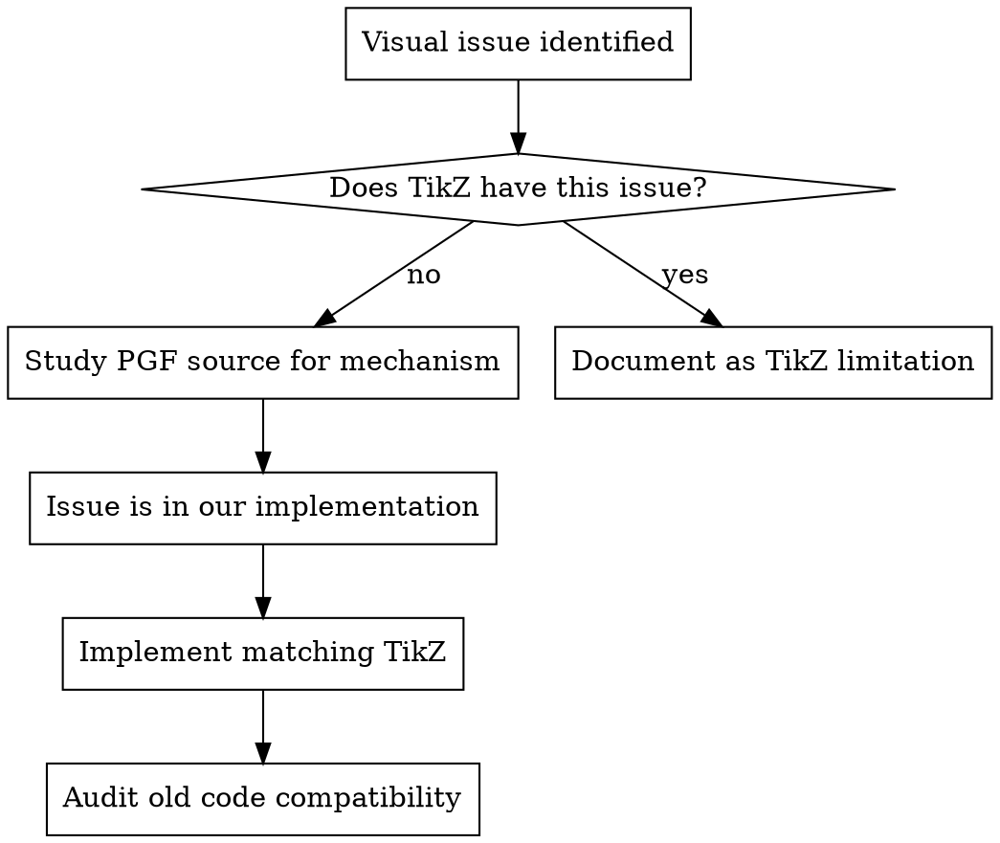

# Building the tikz-svg Library

## Overview

The tikz-svg library reimplements TikZ/PGF graphics in pure JavaScript/SVG. The core principle: **match TikZ behavior by studying PGF source code, never invent ad-hoc fixes.**

## TikZ-Reference-First Development

Before implementing or fixing ANY visual feature:



1. **Does native TikZ have this problem?** Compile the .tex source if available.
2. **If no, HOW does TikZ avoid it?** Read the PGF .tex files in `References/`. grep for the relevant mechanism.
3. **If the file isn't in docs/References/, copy it** from `/usr/local/texlive/2025/texmf-dist/tex/generic/pgf/`.
4. **Implement faithfully.** Match TikZ's algorithm, defaults, and coordinate conventions.

## Architecture

**6-phase render pipeline:** parse → position → node geometry → edge geometry → styles → emit SVG

**Key modules:**
- `shapes/shape.js` — registry + `createShape` factory + `polygonBorderPoint` helper + `dynamicAnchor` support
- `core/arrow-tips.js` — `ArrowTipRegistry` with 18 tips + `createMarker()`
- `geometry/arrows.js` — `getArrowDef()` bridges registry to pipeline, computes auto-shortening
- `geometry/labels.js` — `computeLabelNode()` with TikZ anchor selection
- `geometry/edges.js` — straight, bent, loop + `shortenEdge` post-processing
- `svg/emitter.js` — SVG DOM with generic `backgroundPath()` fallback for new shapes

**Key patterns:**
- Shapes use `outerSep` (anchors enlarged, backgroundPath visual)
- Edges auto-shorten from arrow tip `tipEnd - lineEnd`
- User `shortenEnd` is ADDITIONAL (matches TikZ `shorten >`)
- Labels are rectangle-shape nodes positioned by anchor
- `createShape` factory eliminates boilerplate for new shapes
- `dynamicAnchor(name, geom)` in factory spec enables parameterised anchors (e.g. `puff 3` for cloud)
- SVG y-down: negate y when converting from TikZ y-up

## Sandbox Rules

- `src/` is **live** via symlink at `LECWeb/510/tikz-svg` — NEVER edit
- `src-v2/` is the sandbox — all development here
- `examples-v2/` mirrors `examples/` with import paths pointing to `src-v2/`

## Adding a Shape

Use the `createShape` factory:

```js
import { createShape, polygonBorderPoint } from './shape.js';

export default createShape('my-shape', {
  savedGeometry(config) {
    // config includes center, outerSep, plus shape-specific params
    // Store outerSep, add it to anchor dimensions
    // CRITICAL: store ALL destructured config inputs in the returned geom.
    // The emitter re-calls savedGeometry({...geom, center:{0,0}}) for local paths.
    // Any input not stored in geom vanishes on re-call → zero-sized shapes.
    return { center, halfWidth: hw + outerSep, ..., outerSep };
  },
  namedAnchors(geom) {
    // Return { north, south, east, west, ... } — absolute positions
    // Do NOT include 'center' (factory handles it)
  },
  borderPoint(geom, direction) {
    // For polygons: return polygonBorderPoint(geom.center, direction, vertices)
    // For curves: compute ray-shape intersection
  },
  backgroundPath(geom) {
    // SVG path string using VISUAL dimensions (subtract outerSep)
    // Factory does NOT subtract for you
  },
  // Optional: for shapes with parameterised anchors (e.g. cloud's 'puff N')
  dynamicAnchor(name, geom) {
    // Return {x,y} if name matches a pattern, or null to fall through
    // Resolved after namedAnchors, before numeric angle parsing
  },
});
```

Then register in `index.js`:
```js
import './shapes/my-shape.js';
```

And add a `geomConfig` case in the Phase 3 switch if needed.

## Adding an Arrow Tip

Add to `core/arrow-tips.js`:

```js
const MyTipDef = {
  defaults: { length: 5, width: 3.75, inset: 0, lineWidth: 0.6 },
  path(userParams) {
    const p = resolveParams(this, userParams);
    // Build SVG path string. Tip at (length, 0), arrow points right.
    return {
      d: 'M ... L ... Z',
      lineEnd: ...,    // where line stops inside tip (for auto-shortening)
      tipEnd: ...,     // furthest point of tip
      visualBackEnd: ...,
      fillMode: 'filled' | 'stroke' | 'both',
    };
  },
};
defaultRegistry.register('MyTip', MyTipDef);
```

Then add to `TIP_NAME_MAP` in `geometry/arrows.js`.

Auto-shortening is automatic: pipeline computes `tipEnd - lineEnd` and adds to user's `shortenEnd`.

## Mandatory: Old Code Compatibility Audit

**After implementing ANY improvement, audit all existing code for compatibility:**

1. **Emitter**: Does `createShapeElement` handle the new feature? Check the switch statement — does it need a new case or does the generic `backgroundPath` fallback cover it?
2. **Pipeline**: Does `index.js` Phase 3 pass the right parameters? Check the `geomConfig` switch.
3. **ViewBox**: Does `expandBBoxFromElement` pick up new element types inside `<g>` groups?
4. **Style cascade**: Are new defaults in `constants.js`? Does `resolveEdgeStyle`/`resolveNodeStyle` include them?
5. **Existing shapes**: Do they automatically get `outerSep`, `shorten`, or other improvements?
6. **Dead code**: Are there hardcoded values that should now reference `DEFAULTS`?

This is NOT just regression testing. Ask: **does old code BENEFIT from the new additions?**

## PGF Source Reference

Files in `docs/References/`:

| File | Contains |
|------|----------|
| `tikz.code.tex` | Main parser: auto, swap, pos, edge, shorten |
| `pgfmoduleshapes.code.tex` | Shape system: outer sep, inner sep, anchors |
| `tikzlibrarytopaths.code.tex` | Loop geometry, bend, in/out/looseness |
| `tikzlibraryautomata.code.tex` | Automata library defaults |
| `pgflibraryarrows.meta.code.tex` | 18 modern arrow tips + aliases |
| `pgflibraryshapes.geometric.code.tex` | 10 geometric shapes |
| `pgflibraryshapes.multipart.code.tex` | rectangle split, circle split |
| `pgflibraryshapes.symbols.code.tex` | cloud shape (puff geometry, Bézier arcs) |
| `pgflibraryshapes.callouts.code.tex` | ellipse/rectangle/cloud callout shapes |
| `pgfcorearrows.code.tex` | Arrow placement engine (auto-shortening) |
| `pgfcorepathconstruct.code.tex` | Path construction |

Source location: `/usr/local/texlive/2025/texmf-dist/tex/generic/pgf/`

## Common Coordinate Pitfalls

- TikZ: y-up, 0°=east, CCW positive
- SVG: y-down
- Converting: negate y (`ty = -norm.y`) — see `angleBetween` in `math.js`
- `borderPoint` directions are in SVG coords
- Anchor selection table uses TikZ coords (negate y first)

## Testing

```bash
npm test                    # All tests (486+)
node --test test/file.js    # Single test file
```

Tests use `node --test` + jsdom for DOM. New features need tests in `test/`.

## Browser Demos

Demo HTML files live in `examples-v2/`. Because the library uses ES modules and some dependencies (e.g., mathjs) use bare specifiers that browsers can't resolve from `file://`, **always serve demos via a local HTTP server**:

```bash
npx http-server /Users/sergiop/Dropbox/Scripts/tikz-svg -p 8080 -c-1
open http://localhost:8080/examples-v2/demo-name.html
```

For dependencies like mathjs that have deep bare-import chains, use a **UMD bundle + importmap shim** pattern instead of trying to resolve the full ESM dependency tree. See `examples-v2/plotting-demo.html` and `examples-v2/mathjs-shim.js` for the pattern.
